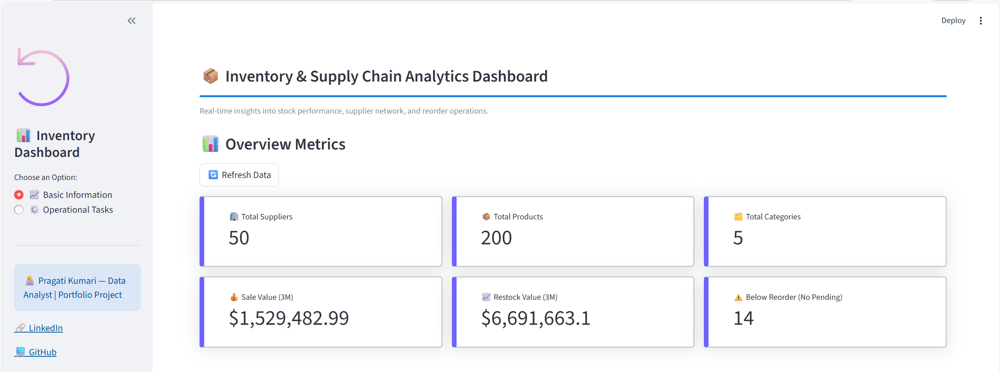
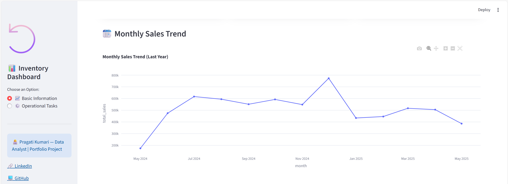
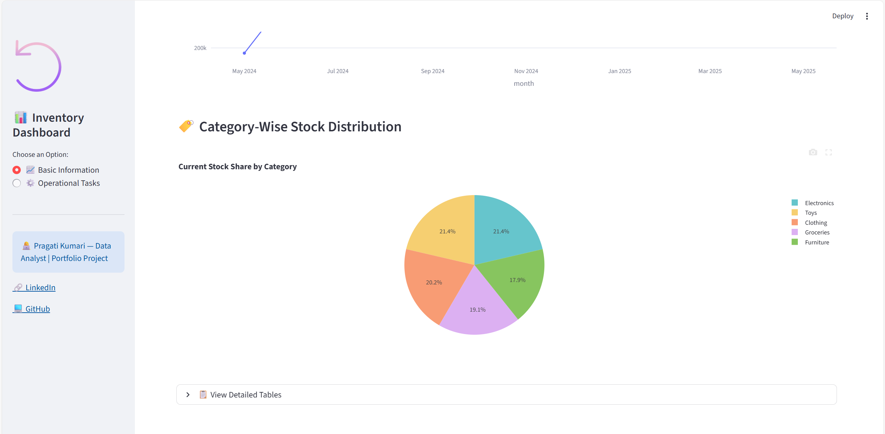
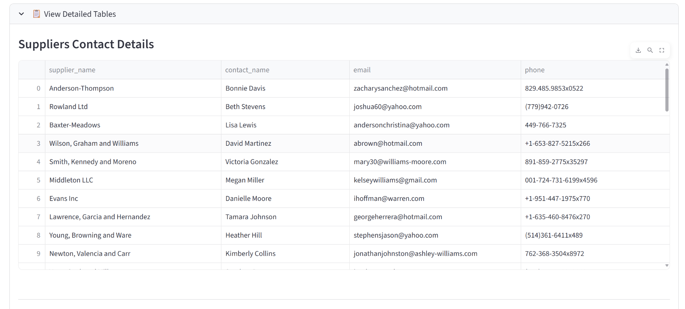
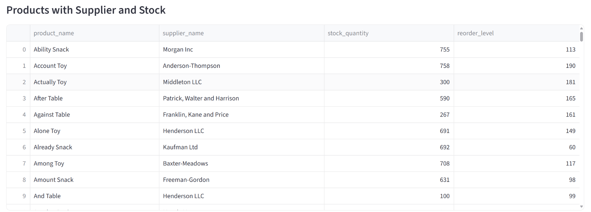
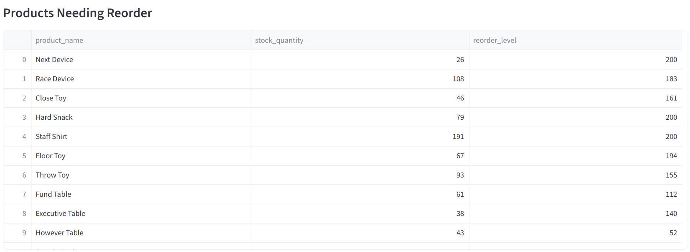
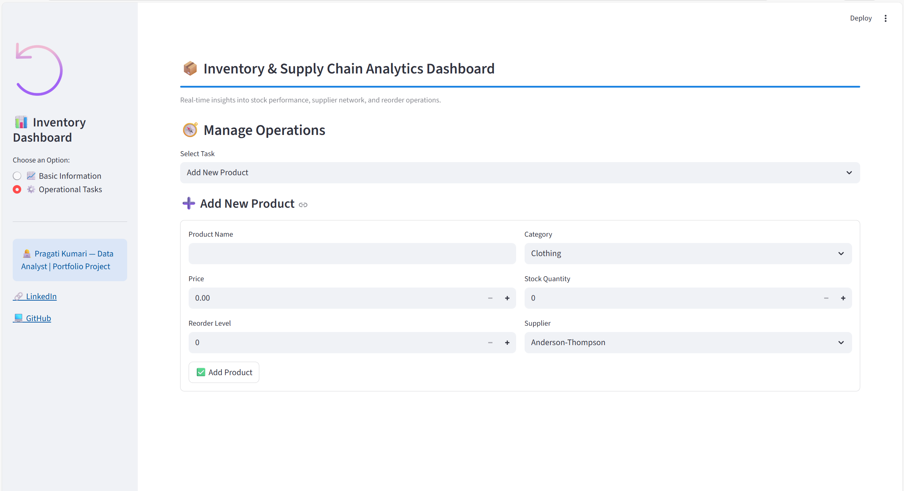

# 📦 Inventory & Supply Chain Management Dashboard

## Overview  
An interactive, full-stack inventory analytics and operations system built using **Python**, **Streamlit**, and **SQL Server**.  
This project was developed by **Pragati Kumari (Data Analyst)** to showcase real-world data engineering, BI, and dashboarding skills.

---

## 📸 Screenshots

### Dashboard Overview















---

## ★ Features  
- **Dashboard & KPIs** — Track suppliers, products, categories, and low stock counts in real time.  
- **Sales Trend Analysis** — Monthly sales captured, visualised in line chart.  
- **Stock Distribution** — Breakdown of stock by category via donut-pie chart.  
- **Operational Controls**:  
  - Add new products (with supplier, price, stock, reorder level)  
  - View product inventory history  
  - Place reorder automatically when stock is low  
  - Receive reorder and update status  

---

## 📁 Project Structure  

Inventory-Management-Dashboard/

│ app.py # Streamlit front-end

│ db_functions_new.py # SQL Server & PyODBC backend logic

│ README.md # Documentation 

---

## 🛠 Tech Stack  
- Front-end: **Streamlit**  
- Back-end: **Python**  
- Database: **SQL Server**  
- Driver: **PyODBC**  
- Data handling: **Pandas**  
- Visualisation: **Plotly Express**

---

## 🛠 Setup Instructions  
### 1. Clone the repository  
```bash
git clone <your-repo-URL>

cd Inventory-Management-Dashboard

```

### 2. Create/setup the database

```
Create a SQL Server database named UI_Project_DB.

Create tables (examples): suppliers, products, stock_entries, product_inventory_history, reorders.

Required stored procedures: AddNewProductManualID, MarkReorderAsReceived.
(Contact me if you’d like schema scripts.)

```

### 3. Run the app
```
streamlit run app.py
```

---

## 🎯 What You’ll See

* Dashboard with key metrics & charts.

*  A form to add new products.

*  Views to check inventory history.

*  Functionality to place and receive reorders.

*   Data tables for deeper detail.

---

## 🚀 Future Enhancements

*  Deploy to Streamlit Cloud with Azure SQL backend.

*  Add login/authentication with roles (Admin/Staff).

*  Enable export to Excel & PDF reports.

*  Implement email notifications for low stock.

*  Add predictive analytics for forecasting inventory.

---

## 👩‍💻 Author

Pragati Kumari — Data Analyst | Python | SQL | Business Intelligence
🔗 LinkedIn: https://www.linkedin.com/in/pragati-kumari-b60352305/

💻 GitHub: https://github.com/Pragati928

---

## ⭐ Support

If you find this project valuable, consider ⭐ starring the repository — thank you!

---
